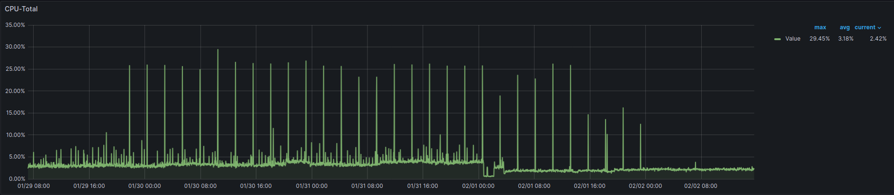

# Nwaku on a Raspberry Pi - The report

### 1. Introduction

Due to the Waku team's interest in measuring the performance of the Waku node on low-powered devices, this report explores the compilation, the spawn, and the monitoring of a Raspberry Pi 4 4GB running a Waku node. 
The report provides directions and recommendations for further replication of the same report, extending the metrics of the already reported by the Waku team on the [GitHub Issue](https://github.com/waku-org/bounties/issues/17#event-11412693356) describing this Bounty.

The bounty describes the following targets for this report:
-  Compile and run nwaku in a RaspberryPi. Run nwaku binaries, not docker image. Publish binaries to be used by others.
- Configure nwaku in RPi to join The Waku Network, inspire yourself from nwaku-compose for the command line arguments to use.
- Written report with the following:
  - Instructions on how to run nwaku joining "The Waku Network" on a RPi.
  - Identify problems and limitations
  - Benchmark nwaku in RPi
  - Identify bottlenecks with RLN

### 2. Set-up of the Environment
As the bounty suggest, this report considers compiling and running `nwaku` on a Raspberry Pi 4 from scratch. 
I've selected a fresh Raspian OS image to start, as it is well documented and it requires many resources to run it.
Raspian is very easy to set up with the provided official [Raspian image-burner](https://www.raspberrypi.com/software/).

###### 2.1 Putting the OS up to date
Once the Raspberry Pi has a micro SD card with Raspian on it, I just had to `update` and `upgrade` the OS using the terminal:
```bash
sudo apt update
sudo apt upgrade
```
###### 2.2 Installation of Docker (for monitoring)
I've found having `docker` installed as a huge plus, specially for the monitoring part (`prometheus`, `node_exporter`, and `grafana`)
To install `docker` I used the [official instructions](https://docs.docker.com/engine/install/debian/#install-using-the-repository)

###### 2.3 Download the dependencies for Nwaku
Nwaku, at the moment of writing this report, doesn't offer any docker image for `arm64`. Thus, I had to compile it from scratch.
To do so, the first thing to do is to clone the [Official Nwaku](https://github.com/waku-org/nwaku) repo by doing:
```bash
git clone https://github.com/waku-org/nwaku`
cd nwaku
```

If you try to compile `nwaku` directly, I found problem with bash not finding `rustc` and `cargo`, as they don't come pre-installed at Raspian.
However, it was something easy to fix by installing the rust compiler:
```bash
sudo apt install rustc
```
This should leave you ready for the compilation.

### 3. Compilation of Nwaku
Once the requirements are installed, the compilation is pretty much straight forward:
```bash
make -j4 nwakunode2
``` 
_NOTE: the flag `-j4` is not stricktly necessary. However, this makes the compilation way faster as it uses the availabe cores of the CPU to speed up the compilation_

I compile it a few times, and it always took between 25 and 30 minutes:
```bash
# Compilation example (it doesn't include the full logs, although they could be shared if needed)
Tue Jan  2 10:23:40 GMT 2024
Building: build/wakunode2
[NimScript] exec: nim c --out:build/wakunode2  --verbosity:0 --hints:off -d:chronicles_log_level=TRACE -d:git_version="v0.23.0-rc.0-7-g07beea" -d:release --passL:librln_v0.3.4.a --passL:-lm apps/wakunode2/wakunode2.nim
Tue Jan  2 10:51:40 GMT 2024
```
#### Download pre-compiled binaries
As the `arm` binaries are not officially provided, I'll leave both binaries (v0.23.0 and v.0.24.0) available for download. If anyone wants to run them, just fetch them by doing:
```bash
wget https://github.com/cortze/rpi-nwaku/build/waku_v0.24.tar.gz
tar -xzvf waku_v0.24.tar.gz .
```
_NOTE: due to the size of the binaries (>100MB), I had to upload them compressed._ 
_NOTE: check the following chapter for the launch of the node._ 

### 4. Launching Nwaku
To Launch Nwaku, I’ve been using a custom launcher shell script that keeps the configuration of the `wakunode2` cli, which uses a SQLite local database and subscribes to the main public topics of the waku network:
```bash
bash ./run_nwaku_on_public.sh
```
For further understanding of the metrics/requirements of the Waku node, I’ve exposed most of the metrics endpoints.

_Note: If the database location uses a restricted path, it might require to run the `wakunode2` with sudo privileges. Be aware of changing the location of the database to the desired path.

### 5. Monitoring Nwaku
Thanks to the guidelines of the [`nwaku-compose`](https://github.com/waku-org/nwaku) repo, It’s very simple to expose and analyze any metrics that `wakunode2` exposes.
I've used a custom variation of `docker-compose.yaml` file to launch `Prometheus`, `node-exporter`, and `grafana`. The variation implied changing the services for the following ones:
```docker
# Services definitions
services:
  prometheus:
    image: docker.io/prom/prometheus:latest
    volumes:
      - ./monitoring/prometheus-config.yml:/etc/prometheus/prometheus.yml:Z
    command:
      - --config.file=/etc/prometheus/prometheus.yml
    network_mode: host
    restart: on-failure:5

  grafana:
    image: docker.io/grafana/grafana:latest
    env_file:
      - ./monitoring/configuration/grafana-plugins.env
    volumes:
      - ./monitoring/configuration/grafana.ini:/etc/grafana/grafana.ini:Z
      - ./monitoring/configuration/dashboards.yaml:/etc/grafana/provisioning/dashboards/dashboards.yaml:Z
      - ./monitoring/configuration/datasources.yaml:/etc/grafana/provisioning/datasources/datasources.yaml:Z
      - ./monitoring/configuration/dashboards:/var/lib/grafana/dashboards/:Z
      - ./monitoring/configuration/customizations/custom-logo.svg:/usr/share/grafana/public/img/grafana_icon.svg:Z
      - ./monitoring/configuration/customizations/custom-logo.svg:/usr/share/grafana/public/img/grafana_typelogo.svg:Z
      - ./monitoring/configuration/customizations/custom-logo.png:/usr/share/grafana/public/img/fav32.png:Z
    network_mode: host
    restart: on-failure:5

  node-exporter:
    image: prom/node-exporter:latest
    network_mode: host
    command: >-
      --path.rootfs=/host
      --web.listen-address=localhost:9100

    pid: host
    restart: unless-stopped
    volumes:
      - '/:/host:ro,rslave'
```

Using the Grafana visualization, I’ve been able to get the graphs explained furhter in detail over the next two sections of the report.  
- Nwaku dashboard provided by [`nwaku-compose`](https://github.com/waku-org/nwaku-compose).
- imported the following dashboard for [Node exporter](https://github.com/kashinoki38/prometheus-sample-yaml/blob/master/grafana/node-exporter-dashboard.json) to monitor the Raspberry Pi's resources. 

### 6. Performance test (Resources & internal RLN metrics)

#### 6.1 Node connected to the public Waku network (no extra - overhead)
The first experiment implied running `nwaku` out of the box in the public waku network. No usage, just measuring the resources and metrics of an IDLE node.
The node was left running for a little bit over 5 days (29/01/2024 to 02/02/2024) using the `./run_nwaku_on_public.sh` configuration.

##### CPU
The overal CPU usage of the node was fairly small, averaging a ~3% acros the 4 cores of the Raspi.

Despite it had sudden peaks that reached the 25-30% of the CPU, the workload is fairly maintained over the cores of the CPU.


##### Memory 
The memory usage on the other hand remained steady across the 5 days. Increasing from ~800MB of total memory usage at the (this measurement includes the entire memory usage of the raspi) to a ~950MB of usage at the end of the 5 days.


##### Connectivity
The node was connected to the public network on the main GossipSub channels. It managed to establish connections with 12 peers at the end of the run, only reaching the 0 peers connections in two occasions during the mornign of the 1st of February.
Otherwise, it has shown fairly reasonable connectivity of an average peer connection count of 7,5 peers. 

_Note: the Raspberry didn't have the ports open, which could jeopardize a bit the connectivity._ 

##### Traffic on the public Waku network
As previously mentioned, the node was openly subscribed to the public Waku GossipSub topics. This means that it had to relay the network's traffic to its neighbours.
The following graphs shows the ratio of messages/second that the Raspberry received over the 5 days. We can appreciate the over those first 3 days, the node was receiving 0.5 messages per second. Until the 1st of February, where the incoming messages drop to 0.

On the other hand, the graph showing the average size of the received messages shows that the average size of the messages stayed over the 86MB. Even when there were no incoming messages for the last 2 days?

It looks like the dashboard is aggregating the size of all the messages and since no new messages arrived after the first three days, the dashboard doesn't change the average size afterward. 

##### RLN metrics
Probably, the most expected metrics from the report, here are the RLN metrics gathered over the 5 days experiment.
The node in the raspi registered 253 RLN memberships, which increased to 258 during the experiment.


Those nodes, generating the message traffic previously mentioned, incurred a RLN proof verification time of the messages shown in the following graph.
The graph shows that despite having heavy noise in the distribution, the average proof verification time stays on the order of 0.3 milliseconds.
Once again, the sudden drop after the 1st of February catches my attention.


On my attempt to find a possible cause of this behaviour at the beginning of february, I could spot that the number of `invalid_roots` started to increase right on the same time.

I'm unsure if this might be a problem originated from the lack of connectivity, or if the lack of connectivity comes from the `invalid_roots`. 
Further research on this aspect might be good to identify any misbehave of the network, or and edgy case in the node's operation.

#### 6.2 Node subscribed to specific topics, which carry a synthetically generated message/min ratio
The second experiments was focused on monitoring the Raspberry Pi under a heavier workload of messages in the network.
For that reason, with the help of @alrevuelta, we set up a small experiment where we created a private network between the Raspberry Pi and my home workstation to inject some synthetic traffic.

If anyone is interested on recreating the experiment, feel free to follow up these steps (requires having `docker` on the workloader node):
1. Stop any existing nwaku node on the Pi, and run the configuration in `./under_load/run_nwaku_on_priv_mode.sh`.
2. On any other machine (make sure that your Raspi ports are open at the router if you won't test the experiment on a local network), set up how many nodes do you want to use for the test and run `/under_load/run_workloader_nodes.sh`.
3. After the initialization of the nodes, you can proceed to configure the ports in use and run `./under_load/run_api_spammer.sh`.
4. Let the API spammer to generate traffic in the private network through the local nodes by interacting with the [`nwaku-API`](https://waku-org.github.io/waku-rest-api/).
5. You might need to stop all the nodes by doing `docker stop $(docker ps -a -q)`

_NOTE: to make the experiment work, you first need to run the `nwaku` node in the raspi and wait until it displays the multiaddres (should look something like `/ip4/<ip-here>/tcp/30304/p2p/16Uiu2HAm3rh5XuWCpBTpZWLukXmpnXiw14v6Yvp69n1ndJRw93Eu"`), and you will have to update the value in `./under_load/run_workloader_nodes.sh`'s `--staticnode` flag to the rpi one._

_NOTE: depending on the number of nodes you want to test it with, you will also have to update the `--ip-colocation-limit` on the `./run_nwaku_on_priv_mode.sh` file. This increases the number of nodes that we allow to connect to the node from the same IP (really important for this experiment)._


##### My experiment set up
The test were conducted on a home workstation with a Ryzen 5900X and 32GB of RAM.
I was able to spawn 50 nodes, later used to generate traffic on an increasing way. 

The workload started from 20 nodes, and then it got increased to 40, then to 50, generating a total of 70.000 messages in an hour.


##### CPU
The CPU usage showed a little bit more of activity this time. On the first part to the experiment (from 19:00 to 19:12), the CPU stayed on the range of 12% to 17%. Later on, when more messages were injected, it increased to a 20% to 27%, which is still reasonable.  

Not many changes were spotted neither when looking at each CPU cores' workload, where the workload seemed to be fairly distributed.


##### Memory
The memory chart on the other hand seems interesting. Despite it was steadily maintained at the 600MB mark, it is 300MB lower than when the node was connected to the public network with almost no interaction.

This might be the result of keeping remote peers' info in cache, though.

##### RLN metrics
Coming back to the most relevant data, the experiment managed to put a message throughput of 13 messages/second first (from 20 nodes), and 20 to 22 messages/second later on with (40 and 50 nodes).

The provided message size was constant of 500Bytes, resulting on a proof verification time of under 0.2 seconds, with some edgy cases where the verification reached the 0.4 seconds. 


### 7. Observations

#### Nwaku on the public network
The node seems to require very few resources when connected to the network. A network that doesn't have much usage at the moment. 
However, it still has some traffic with messages reaching 90KB (fairly bigger than the generated synthetic traffic).
This also results on slower RLN proof verification times. However, the raspi still manages to verify messages with solvency. 

IMHO, it might be worth checking what happened on February 1st, what was first the connectivity issue, of the invalid roots?

#### Nwaku under workload
Despite my home setup couldn't generate a larger network, the raspi still showed a solid performance under some network stress. 
It proved that it could handle 3 to 4 times more traffic, possibly reaching the 50-60 messages/second mark before suffering from a CPU bottleneck.

#### Nwaku RLN-benchmarks
Based on the interest of the `nwaku` team in the RLN verification / generation times, I took the opportunity to run the RLN benchmarks in the Raspberry Pi using the following comands.
```bash
# As referenced by @alrevuelta , the benchmarks were on a separate branch of th repo 
git checkout benchmark-rln

# the benchmarks needed to be compiles
make -j4 benchmarks LOG_LEVEL=NOTICE

# then run
./build/benchmarks
```
giving the following results: 
```bash
Proof generation times: 766 milliseconds, 798 microseconds, and 141 nanoseconds
Proof verification times: 18 milliseconds, 732 microseconds, and 599 nanoseconds
```

#### CPU details
For an extra context on where the benchmarks were run, the CPU of the Raspberry Pi 4b 4GB are the followings:
```bash
~$ lscpu
Architecture:            aarch64
  CPU op-mode(s):        32-bit, 64-bit
  Byte Order:            Little Endian
CPU(s):                  4
  On-line CPU(s) list:   0-3
Vendor ID:               ARM
  Model name:            Cortex-A72
    Model:               3
    Thread(s) per core:  1
    Core(s) per cluster: 4
    Socket(s):           -
    Cluster(s):          1
    Stepping:            r0p3
    CPU(s) scaling MHz:  40%
    CPU max MHz:         1500.0000
    CPU min MHz:         600.0000
    BogoMIPS:            108.00
    Flags:               fp asimd evtstrm crc32 cpuid
Caches (sum of all):
  L1d:                   128 KiB (4 instances)
  L1i:                   192 KiB (4 instances)
  L2:                    1 MiB (1 instance)
Vulnerabilities:
  Gather data sampling:  Not affected
  Itlb multihit:         Not affected
  L1tf:                  Not affected
  Mds:                   Not affected
  Meltdown:              Not affected
  Mmio stale data:       Not affected
  Retbleed:              Not affected
  Spec rstack overflow:  Not affected
  Spec store bypass:     Vulnerable
  Spectre v1:            Mitigation; __user pointer sanitization
  Spectre v2:            Vulnerable
  Srbds:                 Not affected
  Tsx async abort:       Not affected
```

#### Missing direct info about `wakunode2` flags
Specially when running the workload experiments, big kudos to @alrevuelta for the help setting up the experiments, I found that the info at the [`nwaku/config-options`]() wasn't 100% updated with the flags of version v0.24.0.
i.e., flags like `ip-colocation-limit` are not described on the guidelines, delaying a bit the process of stress testing the client.

It would be nice to add a date/version on the page to see whether the guidelines might be outdated or not (just being peaky here, but I think it would help newcomers :) ).

### 8. Conclusion
I've personally found `nwaku` easy to run on the Raspberry Pi. Would it be way easier to provide an `arm` image on docker? yes, it would. However, the compilation time is fairly short taking into account the platform (it takes ~30mins). Thus, there aren't many complaints about it. 
Manual compiling makes handling the deployment with the `nwaku-compose` a little bit more custom, but still works out smoothly.

About the performance of `nwaku`, I haven't found any limitations of running `nwaku` on the Raspberry. CPU and memory requirements are rather small on an IDLE mode, ~4% of CPU usage and under 1GB of memory. This makes the Raspberry Pi a suitable hardware for playing around with a weekend `nwaku` project.

### 9. Links
- https://www.raspberrypi.com/software/
- https://docs.docker.com/engine/install/debian/#install-using-the-repository
- https://github.com/waku-org/nwaku
- https://waku-org.github.io/waku-rest-api/